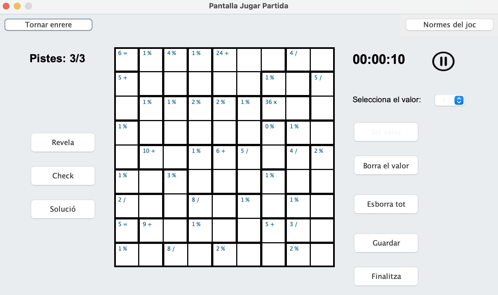

# 🧩 KenKen Solver & Generator

Interactive Java-based application dedicated to the generation, resolution, and analysis of KenKen puzzles using **Backtracking algorithms** and **Layered Architecture**.



## 📊 Overview

This project implements a complete ecosystem for KenKen enthusiasts, combining advanced logic with an intuitive graphical interface.

- **Data Processing**: Persistence layer in JSON/Text to manage user profiles, rankings, and game states.
- **Math Modeling**: Efficient solver based on recursive backtracking with pruning to handle complex constraints.
- **Visualization**: A Java Swing-based GUI providing a seamless user experience for puzzle interaction.

## 🧮 The Logic: Backtracking Algorithm

The core of the solver is a constraint-satisfaction algorithm. For each cell $(i, j)$ in a board of size $N$, the solver ensures:

1. **Row/Column Uniqueness**: $x \in \{1, \dots, N\}$ and $x \notin \text{row}_i, x \notin \text{col}_j$.
2. **Arithmetic Constraint**: The operation result of the cage matches the target value.

$$Result = f(x_1, x_2, \dots, x_n) = Target$$

---

## 🛠️ Tech Stack

- **Backend / Logic**: Java 11 (Domain & Persistence layers).
- **Frontend / UI**: Java Swing, AWT.
- **Data Handling**: JSON-simple library.
- **Build System**: Makefile.

## 🚀 How to Run Locally

1. **Clone the repository:**

   ```bash
   git clone [https://github.com/alvarorm3008/PROP-FIB.git](https://github.com/alvarorm3008/PROP-FIB.git)
   cd PROP-FIB
   ```

2. **Compile and Launch:**
   The project uses a **Makefile** to manage dependencies and resource paths automatically. Run:

   ```bash
   make executa
   ```

3. **Maintenance:**
   To remove compilation files and reset the environment:
   ```bash
   make clean
   ```

---

## 📁 Directory Structure

- **`java-kenken-solver/src`**: Source code organized by layers (Presentation, Domain, Persistence).
- **`java-kenken-solver/lib`**: External dependencies (`json-simple-1.1.jar`).
- **`data/`**: Local database for profiles, rankings, and saved games.
- **`FONTS/`**: Visual assets and icons used by the GUI.

---

**Author:** Alvaro Rodriguez
_Project developed for the PROP course at FIB (UPC)_
